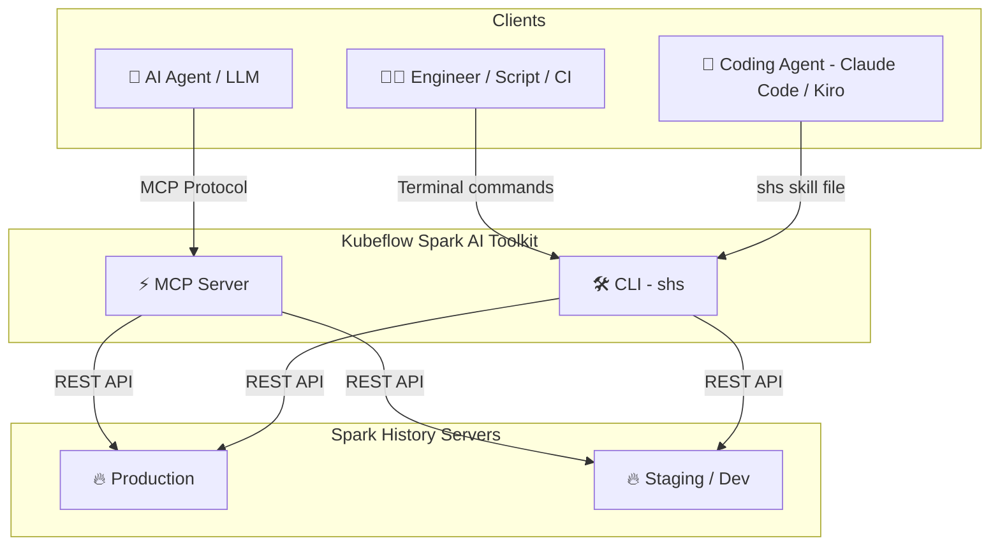

# Kubeflow Spark AI Toolkit

[](https://github.com/kubeflow/mcp-apache-spark-history-server/actions)
[](https://www.python.org/downloads/)
[](https://modelcontextprotocol.io/)
[](https://opensource.org/licenses/Apache-2.0)
[](https://github.com/kubeflow)
[](https://cloud-native.slack.com/archives/C09FRRM6QM7)

> **Connect AI agents and engineers to Apache Spark History Server for intelligent job analysis, performance monitoring, and investigation**

---

> [!IMPORTANT]
> ### ✨ NEW — Spark History Server CLI is now available
> [](skills/cli/README.md)
>
> A standalone Go binary that queries Spark History Server **directly from your terminal** — no MCP, no AI framework, no daemon process. Inspect jobs, compare runs, investigate failures, and script against the Spark REST API.
>
> **[Get started with the SHS CLI →](skills/cli/README.md)**

---


This project provides **two interfaces** to your Spark History Server data:

| | 🛠️ [SHS CLI (`shs`)](#️-shs-cli-shs--for-engineers--scripts) | ⚡ [MCP Server](#-mcp-server--for-ai-agents) |
|---|---|---|
| **For** | Engineers, shell scripts, CI/CD, coding agents | AI agents and MCP-compatible clients |
| **Mental model** | "I know the command I want to run" | "Agent, investigate this Spark app" |
| **Install** | Single static binary — no dependencies | Python 3.12+, uv |
| **Get started** | [CLI docs →](skills/cli/README.md) | [MCP docs →](#-mcp-server--for-ai-agents) |

📺 **See it in action:**
[](https://www.youtube.com/watch?v=e3P_2_RiUHw)

---

## 🛠️ SHS CLI (`shs`) — For Engineers & Scripts

A standalone Go binary. Query your Spark History Server directly from the terminal, shell scripts, or CI/CD pipelines. Also works as a **skill** for coding agents like Claude Code and Kiro.

### Install

```bash
# Auto-detect latest version, OS, and architecture
VERSION=$(curl -s https://api.github.com/repos/kubeflow/mcp-apache-spark-history-server/releases | grep -m1 '"tag_name": "cli/' | cut -d'"' -f4 | sed 's|cli/||')
OS=$(uname -s | tr '[:upper:]' '[:lower:]')
ARCH=$(uname -m)
[ "$ARCH" = "x86_64" ] && ARCH="amd64"
[ "$ARCH" = "aarch64" ] && ARCH="arm64"

curl -sSL "https://github.com/kubeflow/mcp-apache-spark-history-server/releases/download/cli%2F${VERSION}/shs-${VERSION}-${OS}-${ARCH}.tar.gz" | tar xz
sudo mv shs /usr/local/bin/
```

### Quick Start

```bash
# Generate a config file
shs setup config > config.yaml   # then set your Spark History Server URL

# Explore applications
shs apps
shs jobs -a APP_ID --status failed
shs stages -a APP_ID --sort duration
shs compare apps --app-a APP1 --app-b APP2

# Use as a skill with Claude Code or Kiro
shs setup skill > ~/.claude/skills/spark-history.md
```

**[CLI documentation](skills/cli/README.md)** for full usage, or check out a [real-world example](skills/cli/examples/compare/README.md) of Claude Code comparing two **TPC-DS 3TB benchmark** runs.

---

## ⚡ MCP Server — For AI Agents

An [MCP (Model Context Protocol)](https://modelcontextprotocol.io/) server that exposes Spark History Server data as tools for AI agents. Agents query your Spark infrastructure using natural language — the server handles tool selection, multi-server routing, and structured data retrieval.

**Use the MCP server when** you want an AI agent to conduct multi-step investigations, synthesize findings across tools, or answer natural-language questions about your Spark applications.

### Install

```bash
# Run directly with uvx (no install needed)
uvx --from mcp-apache-spark-history-server spark-mcp

# Or install with pip
uv tool install mcp-apache-spark-history-server
spark-mcp
```

The package is published to [PyPI](https://pypi.org/project/mcp-apache-spark-history-server/).

### Coding Agent Integration

Register the server with a single command. Both examples run it over **stdio** via `uvx`.
With no config file present, the server defaults to a Spark History Server at `http://localhost:18080`;
point it elsewhere with a [config file](#config-file-location) or `SHS_SERVERS__LOCAL__URL`.

**Claude Code** (`claude mcp add`):

```bash
claude mcp add --env SHS_MCP__TRANSPORT=stdio --env SHS_SERVERS__LOCAL__URL=http://localhost:18080\
  --transport stdio spark-history \
  -- uvx --from mcp-apache-spark-history-server spark-mcp
```

**Kiro CLI** (`kiro-cli mcp add`):

```bash
kiro-cli mcp add --name spark-history --command uvx \
  --args --from --args mcp-apache-spark-history-server --args spark-mcp \
  --env SHS_MCP__TRANSPORT=stdio --env SHS_SERVERS__LOCAL__URL=http://localhost:18080
```

Verify in either client with `claude mcp list` / `kiro-cli mcp list`, then ask the agent to *"list the available Spark applications."*

The server also ships **prompts** — guided, multi-step workflows you run as a command. In Claude Code: `/mcp__spark-history__investigate_failure <app_id>`. In Kiro CLI: `/prompts investigate_failure` (or `@investigate_failure`). See [Prompts](#prompts-2) for the full list and arguments.

#### Passing server flags and environment

The commands above have two layers: the **client's** own options and the arguments/environment forwarded to **`spark-mcp`**. `spark-mcp` itself takes a single flag, `--config` / `-c`; everything else is set through `SHS_*` [environment variables](#configure).

| To pass to `spark-mcp`… | Claude Code | Kiro CLI |
|---|---|---|
| A flag (e.g. `--config`) | append after `--`: `… spark-mcp --config /path/config.yaml` | add `--args` pairs: `--args --config --args /path/config.yaml` |
| An environment variable | `--env KEY=value` (before `--transport`) | `--env KEY=value` |

For example, to point at a remote Spark History Server with an explicit config file:

```bash
# Claude Code
claude mcp add --env SHS_MCP__TRANSPORT=stdio --transport stdio spark-history \
  -- uvx --from mcp-apache-spark-history-server spark-mcp --config ~/.config/spark-mcp/config.yaml

# Kiro CLI
kiro-cli mcp add --name spark-history --command uvx \
  --args --from --args mcp-apache-spark-history-server --args spark-mcp \
  --args --config --args ~/.config/spark-mcp/config.yaml \
  --env SHS_MCP__TRANSPORT=stdio
```

### Configure

Basic configuration below. Create a file named `config.yaml`:

```yaml
servers:
  local:
    default: true
    url: "http://your-spark-history-server:18080"
    auth:            # optional
      username: "user"
      password: "pass"
    include_plan_description: false   # include SQL plans by default (default: false)
mcp:
  transport: "streamable-http"   # or: stdio
  port: "18888"
  debug: false
```

#### Config file location

The server looks for its config file in the following order and uses the first one it finds:

1. The `--config` / `-c` flag (e.g. `spark-mcp --config /path/to/config.yaml`)
2. The `SHS_MCP_CONFIG` environment variable
3. `./config.yaml` in the current working directory
4. `~/.config/spark-mcp/config.yaml` (honors `$XDG_CONFIG_HOME` when set)

If none exist, the server starts with built-in defaults that can be overridden by `SHS_*` environment variables. When a path is given explicitly via the flag or `SHS_MCP_CONFIG` but the file is missing, the server fails fast instead of falling back.

> **Tip for MCP clients:** when the server is launched by an MCP client (Claude Desktop, Kiro, etc.), the working directory is not guaranteed, so a `./config.yaml` may not be found. Prefer `--config` / `SHS_MCP_CONFIG`, or place the file at `~/.config/spark-mcp/config.yaml`.

Configurations can be overriden with environment variables. Nesting levels are
separated by a **double underscore** (`__`), so field names and server names may
themselves contain single underscores (e.g. `SHS_SERVERS__MY_SERVER__URL` maps
to `servers.my_server.url`).

```
SHS_MCP__PORT          Port for MCP server (default: 18888)
SHS_MCP__TRANSPORT     Transport mode: streamable-http or stdio
SHS_MCP__DEBUG         Enable debug mode (default: false)
SHS_MCP__ADDRESS       Bind address (default: localhost)
SHS_SERVERS__*__URL     URL for a specific server
SHS_SERVERS__*__AUTH__USERNAME
SHS_SERVERS__*__AUTH__PASSWORD
SHS_SERVERS__*__AUTH__TOKEN
SHS_SERVERS__*__VERIFY_SSL
SHS_SERVERS__*__TIMEOUT
SHS_SERVERS__*__EMR_CLUSTER_ARN
SHS_SERVERS__*__INCLUDE_PLAN_DESCRIPTION
```

### Multi-Server Setup

Configure multiple Spark History Servers and route queries to specific ones:

```yaml
servers:
  production:
    default: true
    url: "http://prod-spark-history:18080"
    auth:
      username: "user"
      password: "pass"
  staging:
    url: "http://staging-spark-history:18080"
```

Agents can target a specific server per query:

> *"Get application `<app_id>` from the production server"*

## 🏗️ Architecture



### Connect an AI Agent

| Agent | Transport | Guide |
|-------|-----------|-------|
| **Claude Desktop** | stdio | [Setup →](examples/integrations/claude-desktop/) |
| **Claude Code** | stdio or streamable-http  | [Setup →](examples/integrations/claude-desktop/) |
| **Kiro** | streamable-http | [Setup →](examples/integrations/kiro/) |
| **LangGraph** | streamable-http | [Setup →](examples/integrations/langgraph/) |
| **Strands Agents** | streamable-http | [Setup →](examples/integrations/strands-agents/) |
| **Local / Inspector** | streamable-http | [Setup →](TESTING.md) |

### Available Tools (19)

<details>
<summary>Available Tools</summary>

#### Application Information
| Tool | Description |
|------|-------------|
| `list_applications` | List applications with optional status, date, and limit filters; pass `app_id` for a single application's detail (status, resources, duration, attempts). Returned applications always include their attempts. |

#### Job Analysis
| Tool | Description |
|------|-------------|
| `list_jobs` | List jobs with status/job-id filtering and sorting (e.g. slowest by duration) |

#### Stage Analysis
| Tool | Description |
|------|-------------|
| `list_stages` | List stages with status filtering and sorting (e.g. slowest by duration) |
| `get_stage` | Stage detail with attempt and task metric distributions |
| `list_stage_task_failures` | Failed tasks of a stage with their error messages (exception/stack trace) |

#### Executor & Resource Analysis
| Tool | Description |
|------|-------------|
| `list_executors` | List executors with executor-id filtering and sorting (failed-tasks/duration/gc/id) |
| `get_executor_summary` | Aggregate metrics across all executors |
| `get_resource_usage_timeline` | Chronological executor add/remove with resource totals |
| `get_executor_thread_dump` | JVM thread dump for a driver/executor, with state/name/blocked filters (running apps only) |

#### Configuration & Environment
| Tool | Description |
|------|-------------|
| `get_environment` | Spark config, JVM info, system properties, classpath; optional `section` filter to return a single part |

#### SQL & Query Analysis
| Tool | Description |
|------|-------------|
| `list_sql_executions` | List SQL executions as curated summaries, with status/description filters, sorting, and a default limit |
| `get_sql_execution` | SQL execution header by default; opt-in plan, node metrics, job summaries, aggregated stage metrics, and stage list |
| `compare_sql_executions` | Compare aggregated performance metrics (stages, tasks, shuffle, spill, GC) between two SQL executions; opt-in plan-structure diff |

#### Performance & Bottleneck Analysis
| Tool | Description |
|------|-------------|
| `get_job_bottlenecks` | Identify bottlenecks across stages, tasks, and executors |

#### Comparative Analysis
| Tool | Description |
|------|-------------|
| `compare_job_environments` | Diff Spark configs between two applications |
| `compare_job_performance` | Diff performance metrics between two applications |
| `compare_stages` | Compare two stages (optionally across applications): stage metrics and per-task p25/p50/p75/max quantiles |

#### AWS Spark Troubleshooting (opt-in)
| Tool | Description |
|------|-------------|
| `aws_analyze_spark_workload` | One-shot root cause analysis of failed/slow Spark workloads |
| `aws_spark_code_recommendation` | Code fix recommendations for identified Spark issues |

> Automatically available when AWS credentials and region are configured. See [IAM setup guide](https://docs.aws.amazon.com/emr/latest/ReleaseGuide/spark-troubleshooting-agent-iam-setup.html).

</details>

#### Example Agent Queries
- *"Why is my ETL job running slower than yesterday?"* → `get_job_bottlenecks` + `list_stages` + `compare_job_performance`
- *"What caused job 42 to fail?"* → `list_jobs` + `get_stage`
- *"Compare today's batch with yesterday's run"* → `compare_job_performance` + `compare_job_environments`
- *"Find my slowest SQL queries and explain why"* → `list_sql_executions` + `get_sql_execution` + `compare_sql_executions`

### Prompts (2)

Beyond tools, the server exposes **MCP prompts** — reusable, multi-step investigation workflows that your agent runs as a single command. Each prompt expands into a guided sequence of tool calls (which the agent still executes one at a time), so you get a consistent, evidence-driven analysis without having to remember the right tool order.

| Prompt | Arguments | Description |
|--------|-----------|-------------|
| `investigate_failure` | `app_id` (required), `server` (optional) | Guided root-cause investigation for a failed Spark application — walks from the failed app down to the individual task exceptions. |
| `compare_applications` | `app_a` (required), `app_b` (required), `server` (optional), `context` (optional) | Layered, descriptive comparison of two applications (configuration → app metrics → SQL/jobs → stages). |

> `server` is optional: when omitted, the prompt searches every configured server for the application(s). Pass `server="<name>"` only to target a specific server or disambiguate an id that exists on more than one.

#### Using prompts in Claude Code

MCP prompts surface as slash commands with the format `/mcp__<server>__<prompt>` (note the **double underscores**), where `<server>` is the name you registered the server under (`spark-history` in the [examples above](#coding-agent-integration)). Type `/` to discover them, then pass arguments space-separated after the command:

```text
# Investigate a failed application
/mcp__spark-history__investigate_failure spark-cc4d615a5e6b4500b8eb1e9deb48cb4e

# Target a specific configured server
/mcp__spark-history__investigate_failure spark-cc4d615a5e6b4500b8eb1e9deb48cb4e production

# Compare two applications
/mcp__spark-history__compare_applications spark-app-A spark-app-B
```

#### Using prompts in Kiro CLI

List and run prompts with the `/prompts` command, or type `@` then Tab to autocomplete. Run a prompt by name and supply its arguments:

```text
# Open the prompt picker (shows prompts from all MCP servers)
/prompts

# Run a prompt directly
/prompts investigate_failure

# Or use the @ shortcut
@investigate_failure
```

Kiro CLI prompts you for arguments interactively when the prompt declares them, so you can run `/prompts investigate_failure` and provide `app_id` (and optionally `server`) when asked.

---

## 📸 Screenshots

### 🔍 Get Spark Application


### ⚡ Job Performance Comparison


---

## 🚀 Kubernetes Deployment

Deploy the MCP server using Helm:

```bash
helm install spark-history-mcp ./deploy/kubernetes/helm/mcp-apache-spark-history-server/

# Production configuration
helm install spark-history-mcp ./deploy/kubernetes/helm/mcp-apache-spark-history-server/ \
  --set replicaCount=3 \
  --set autoscaling.enabled=true
```

See [`deploy/kubernetes/helm/`](deploy/kubernetes/helm/) for full configuration options.

When deployed in Kubernetes, connect Claude Desktop via `mcp-remote`:
```bash
kubectl port-forward svc/mcp-apache-spark-history-server 18888:18888
```

---

## 📔 AWS Integration

- **[AWS Glue](examples/aws/glue/README.md)** — Connect to Glue Spark History Server
- **[Amazon EMR](examples/aws/emr/README.md)** — Use EMR Persistent UI for Spark analysis
- **AWS Spark Troubleshooting** — One-shot root cause analysis and code fix recommendations for failed Spark workloads (EMR EC2, EMR Serverless). Automatically available when AWS credentials and region are configured. See [IAM setup guide](https://docs.aws.amazon.com/emr/latest/ReleaseGuide/spark-troubleshooting-agent-iam-setup.html) for required permissions.

---

## 🔧 Development Setup

```bash
git clone https://github.com/kubeflow/mcp-apache-spark-history-server.git
cd mcp-apache-spark-history-server

# Install Task runner
brew install go-task   # macOS; see https://taskfile.dev/installation/ for others

# MCP Server
task install           # install Python dependencies
task start-spark-bg    # start Spark History Server with sample data
task start-mcp-bg      # start MCP server
task start-inspector-bg  # open MCP Inspector at http://localhost:6274
task stop-all

# CLI
cd skills/cli
task build             # build ./bin/shs
task test              # unit tests
task test-e2e          # e2e tests (starts/stops Docker SHS automatically)
task start-shs         # start SHS with CLI e2e sample data
```

---

## 🌍 Adopters

Using this project? Add your organization to [ADOPTERS.md](ADOPTERS.md) and help grow the community.

## 🤝 Contributing

See [CONTRIBUTING.md](CONTRIBUTING.md) for guidelines.

## 📄 License

Apache License 2.0 — see [LICENSE](LICENSE).

## 📝 Trademark Notice

*Built for use with Apache Spark™ History Server. Not affiliated with or endorsed by the Apache Software Foundation.*

---

<div align="center">

**Connect your Spark infrastructure to AI agents and engineers**

[🛠️ SHS CLI](skills/cli/README.md) · [⚡ MCP Server](#-mcp-server--for-ai-agents) · [🧪 Test](TESTING.md) · [🤝 Contribute](#-contributing)

*Built by the community, for the community* 💙

</div>
